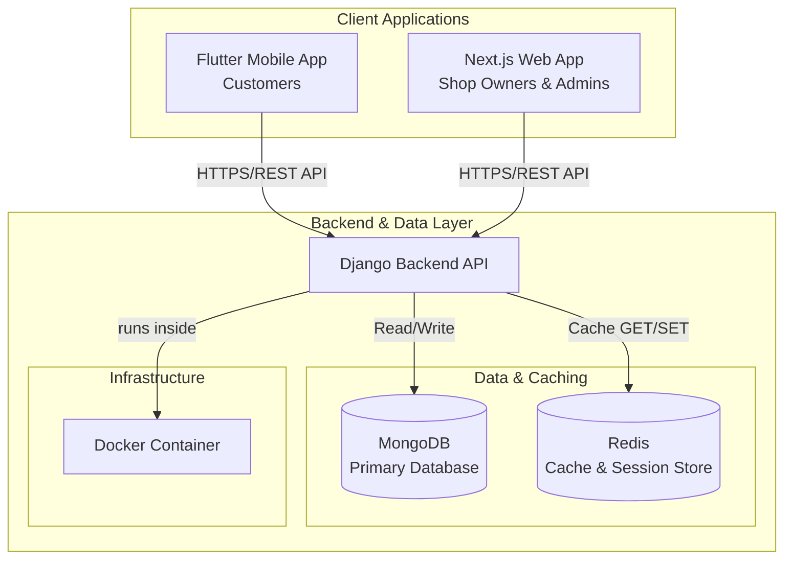

```mermaid
flowchart TD
    subgraph Clients [Client Applications]
        A[Flutter Mobile App<br/>Customers]
        B[Next.js Web App<br/>Shop Owners & Admins]
    end

    subgraph Backend [Backend & Data Layer]
        C[Django Backend API]
        
        subgraph Data [Data & Caching]
            D[(MongoDB<br/>Primary Database)]
            E[(Redis<br/>Cache & Session Store)]
        end

        subgraph Infra [Infrastructure]
            F[Docker Container]
        end
    end

    A -- HTTPS/REST API --> C
    B -- HTTPS/REST API --> C
    C -- Read/Write --> D
    C -- Cache GET/SET --> E
    C -- runs inside --> F
```