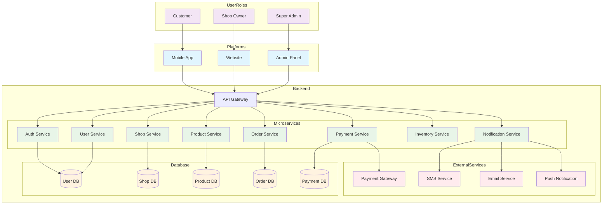

```mermaid
graph TB
    %% Platforms and Users
    subgraph Platforms
        APP[Mobile App]
        WEB[Website]
        ADMIN[Admin Panel]
    end

    subgraph UserRoles
        CUST[Customer]
        OWNER[Shop Owner]
        SADMIN[Super Admin]
    end

    %% Backend Structure
    subgraph Backend
        API[API Gateway]
        
        subgraph Microservices
            AUTH[Auth Service]
            USER[User Service]
            SHOP[Shop Service]
            PROD[Product Service]
            ORDER[Order Service]
            PAY[Payment Service]
            INV[Inventory Service]
            NOTIF[Notification Service]
        end

        subgraph Database
            DB1[(User DB)]
            DB2[(Shop DB)]
            DB3[(Product DB)]
            DB4[(Order DB)]
            DB5[(Payment DB)]
        end

        subgraph ExternalServices
            PAYEXT[Payment Gateway]
            SMSEXT[SMS Service]
            EMAILEXT[Email Service]
            PUSH[Push Notification]
        end
    end

    %% Connections
    CUST --> APP
    OWNER --> WEB
    SADMIN --> ADMIN

    APP --> API
    WEB --> API
    ADMIN --> API

    API --> AUTH
    API --> USER
    API --> SHOP
    API --> PROD
    API --> ORDER
    API --> PAY
    API --> INV
    API --> NOTIF

    AUTH --> DB1
    USER --> DB1
    SHOP --> DB2
    PROD --> DB3
    ORDER --> DB4
    PAY --> DB5

    NOTIF --> SMSEXT
    NOTIF --> EMAILEXT
    NOTIF --> PUSH
    PAY --> PAYEXT

    %% Styling
    classDef platform fill:#e1f5fe
    classDef role fill:#f3e5f5
    classDef service fill:#e8f5e8
    classDef database fill:#fff3e0
    classDef external fill:#ffebee

    class APP,WEB,ADMIN platform
    class CUST,OWNER,SADMIN role
    class AUTH,USER,SHOP,PROD,ORDER,PAY,INV,NOTIF service
    class DB1,DB2,DB3,DB4,DB5 database
    class PAYEXT,SMSEXT,EMAILEXT,PUSH external
```