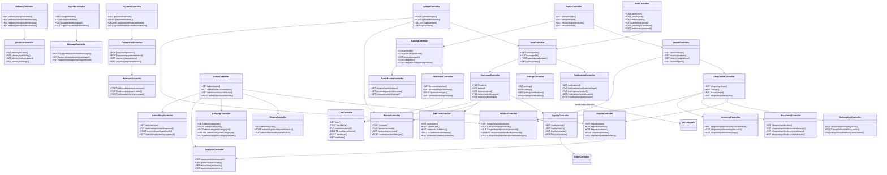

```mermaid
classDiagram
    %% API Controller Classes
    class AuthController {
        +POST /auth/login()
        +POST /auth/logout()
        +POST /auth/register()
        +PUT /auth/refresh-token()
        +POST /auth/forgot-password()
        +POST /auth/reset-password()
    }

    class UserController {
        +GET /users/profile()
        +PUT /users/profile()
        +POST /users/upload-avatar()
        +GET /users/activity()
    }

    class CustomerController {
        +POST /orders()
        +GET /orders()
        +GET /orders/_orderId_()
        +PUT /orders/_orderId_/cancel()
        +GET /orders/_orderId_/track()
    }

    class CartController {
        +GET /cart()
        +POST /cart/items()
        +PUT /cart/items/_itemId_()
        +DELETE /cart/items/_itemId_()
        +POST /cart/clear()
        +GET /cart/total()
    }

    class AddressController {
        +GET /addresses()
        +POST /addresses()
        +PUT /addresses/_addressId_()
        +DELETE /addresses/_addressId_()
        +PUT /addresses/_addressId_/default()
    }

    class ReviewController {
        +POST /reviews()
        +PUT /reviews/_reviewId_()
        +GET /reviews/my-reviews()
        +POST /reviews/_reviewId_/images()
    }

    class ShopOwnerController {
        +GET /shops/my-shops()
        +POST /shops()
        +PUT /shops/_shopId_()
        +GET /shops/_shopId_/analytics()
    }

    class ProductController {
        +GET /shops/_shopId_/products()
        +POST /shops/_shopId_/products()
        +PUT /shops/_shopId_/products/_productId_()
        +DELETE /shops/_shopId_/products/_productId_()
        +POST /shops/_shopId_/products/_productId_/images()
    }

    class InventoryController {
        +PUT /shops/_shopId_/products/_productId_/stock()
        +GET /shops/_shopId_/inventory/low-stock()
        +GET /shops/_shopId_/inventory/logs()
    }

    class ShopOrderController {
        +GET /shops/_shopId_/orders()
        +PUT /shops/_shopId_/orders/_orderId_/accept()
        +PUT /shops/_shopId_/orders/_orderId_/ready()
        +PUT /shops/_shopId_/orders/_orderId_/status()
    }

    class DeliveryAreaController {
        +GET /shops/_shopId_/delivery-areas()
        +POST /shops/_shopId_/delivery-areas()
        +PUT /shops/_shopId_/delivery-areas/_areaId_()
    }

    class AdminController {
        +GET /admin/users()
        +PUT /admin/users/_userId_/status()
        +GET /admin/users/_userId_/details()
        +POST /admin/users/_userId_/verify()
    }

    class AdminShopController {
        +GET /admin/shops()
        +PUT /admin/shops/_shopId_/approval()
        +POST /admin/shops/_shopId_/verify()
        +GET /admin/shops/pending-approval()
    }

    class AnalyticsController {
        +GET /admin/analytics/overview()
        +GET /admin/analytics/sales()
        +GET /admin/analytics/users()
        +GET /admin/analytics/orders()
    }

    class CategoryController {
        +GET /admin/categories()
        +POST /admin/categories()
        +PUT /admin/categories/_categoryId_()
        +DELETE /admin/categories/_categoryId_()
        +PUT /admin/categories/_categoryId_/order()
    }

    class DisputeController {
        +GET /admin/disputes()
        +POST /admin/disputes/_disputeId_/resolve()
        +PUT /admin/disputes/_disputeId_/status()
    }

    class DeliveryController {
        +GET /delivery/assigned-orders()
        +PUT /delivery/orders/_orderId_/accept()
        +PUT /delivery/orders/_orderId_/pickup()
        +PUT /delivery/orders/_orderId_/deliver()
    }

    class LocationController {
        +PUT /delivery/location()
        +PUT /delivery/availability()
        +GET /delivery/current-status()
        +GET /delivery/earnings()
    }

    class PaymentController {
        +GET /payment/methods()
        +POST /payment/methods()
        +DELETE /payment/methods/_methodId_()
        +PUT /payment/methods/_methodId_/default()
    }

    class TransactionController {
        +POST /payment/process()
        +POST /payment/_paymentId_/refund()
        +GET /payment/transactions()
        +GET /payment/_paymentId_/status()
    }

    class WebhookController {
        +POST /webhooks/payment-success()
        +POST /webhooks/payment-failed()
        +POST /webhooks/refund-processed()
    }

    class SupportController {
        +GET /support/tickets()
        +POST /support/tickets()
        +GET /support/tickets/_ticketId_()
        +PUT /support/tickets/_ticketId_/status()
    }

    class MessageController {
        +POST /support/tickets/_ticketId_/messages()
        +GET /support/tickets/_ticketId_/messages()
        +PUT /support/messages/_messageId_/read()
    }

    class PublicController {
        +GET /shops/nearby()
        +GET /shops/_shopId_()
        +GET /shops/_shopId_/products()
        +GET /shops/search()
    }

    class CatalogController {
        +GET /products()
        +GET /products/_productId_()
        +GET /products/search()
        +GET /categories()
        +GET /categories/_categoryId_/products()
    }

    class PublicReviewController {
        +GET /shops/_shopId_/reviews()
        +GET /products/_productId_/reviews()
        +GET /reviews/_reviewId_/ratings()
    }

    %% Additional Controllers to Complete the System
    class NotificationController {
        +GET /notifications()
        +PUT /notifications/_notificationId_/read()
        +PUT /notifications/read-all()
        +GET /notifications/unread-count()
        +POST /notifications/preferences()
    }

    class SearchController {
        +GET /search/shops()
        +GET /search/products()
        +GET /search/suggestions()
        +GET /search/global()
    }

    class UploadController {
        +POST /upload/images()
        +POST /upload/documents()
        +DELETE /upload/_fileId_()
        +GET /upload/_fileId_()
    }

    class PromotionController {
        +GET /promotions/active()
        +GET /promotions/_promotionId_()
        +POST /promotions/apply()
        +GET /promotions/shop/_shopId_()
    }

    class LoyaltyController {
        +GET /loyalty/points()
        +GET /loyalty/history()
        +GET /loyalty/rewards()
        +POST /loyalty/redeem()
    }

    class ReportController {
        +GET /reports/sales()
        +GET /reports/inventory()
        +GET /reports/customer()
        +POST /reports/generate()
        +GET /reports/_reportId_/download()
    }

    class SettingsController {
        +GET /settings()
        +PUT /settings()
        +GET /settings/notifications()
        +PUT /settings/notifications()
    }

    %% Complete Relationships between controllers
    AuthController --> UserController
    UserController --> CustomerController
    UserController --> SettingsController
    CustomerController --> CartController
    CustomerController --> AddressController
    CustomerController --> ReviewController
    CustomerController --> LoyaltyController
    ShopOwnerController --> ProductController
    ShopOwnerController --> InventoryController
    ShopOwnerController --> ShopOrderController
    ShopOwnerController --> DeliveryAreaController
    ShopOwnerController --> ReportController
    AdminController --> AdminShopController
    AdminController --> AnalyticsController
    AdminController --> CategoryController
    AdminController --> DisputeController
    AdminController --> ReportController
    DeliveryController --> LocationController
    PaymentController --> TransactionController
    TransactionController --> WebhookController
    SupportController --> MessageController
    PublicController --> CatalogController
    PublicController --> SearchController
    CatalogController --> PublicReviewController
    CatalogController --> PromotionController
    UserController --> NotificationController
    UploadController --> ProductController
    UploadController --> ReviewController
    UploadController --> UserController
    
    %% Additional Dependency Relationships
    PromotionController --> CartController
    LoyaltyController --> OrderController
    NotificationController --> AllControllers : "sends notifications to"
    SearchController --> ProductController
    SearchController --> ShopOwnerController
    ReportController --> AnalyticsController
```