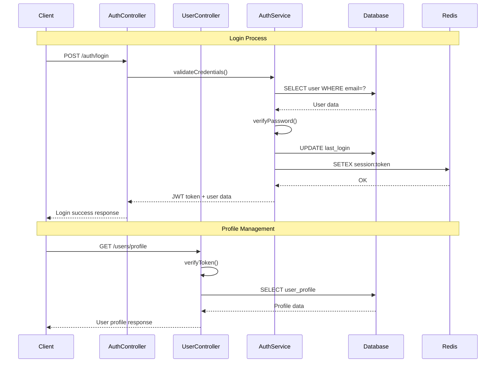

```mermaid
sequenceDiagram
    participant C as Client
    participant A as AuthController
    participant U as UserController
    participant S as AuthService
    participant D as Database
    participant R as Redis

    Note over C,R: Login Process
    C->>A: POST /auth/login
    A->>S: validateCredentials()
    S->>D: SELECT user WHERE email=?
    D-->>S: User data
    S->>S: verifyPassword()
    S->>D: UPDATE last_login
    S->>R: SETEX session:token
    R-->>S: OK
    S-->>A: JWT token + user data
    A-->>C: Login success response

    Note over C,R: Profile Management
    C->>U: GET /users/profile
    U->>U: verifyToken()
    U->>D: SELECT user_profile
    D-->>U: Profile data
    U-->>C: User profile response
```