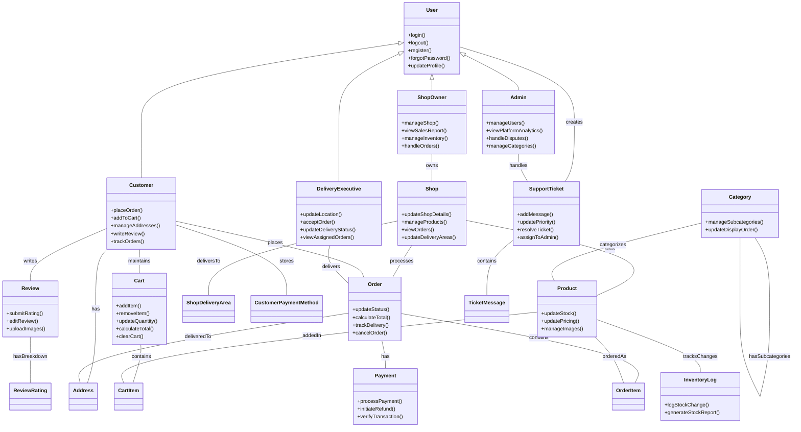

```mermaid
classDiagram
    %% User Management Classes
    class User
    class Customer
    class ShopOwner
    class Admin
    class DeliveryExecutive

    %% Core Business Classes
    class Shop
    class Category
    class Product
    class InventoryLog

    %% Order Management Classes
    class Order
    class OrderItem
    class Cart
    class CartItem

    %% Address & Location Classes
    class Address
    class ShopDeliveryArea

    %% Payment Classes
    class Payment
    class CustomerPaymentMethod

    %% Reviews & Support Classes
    class Review
    class ReviewRating
    class SupportTicket
    class TicketMessage

    %% User Inheritance Hierarchy
    User <|-- Customer
    User <|-- ShopOwner
    User <|-- Admin
    User <|-- DeliveryExecutive

    %% Shop Management Relationships
    ShopOwner -- Shop : owns
    Shop -- Product : sells
    Shop -- Order : processes
    Shop -- ShopDeliveryArea : deliversTo

    %% Product Catalog Relationships
    Category -- Product : categorizes
    Category -- Category : hasSubcategories

    %% Customer Activities
    Customer -- Order : places
    Customer -- Address : has
    Customer -- Cart : maintains
    Customer -- CustomerPaymentMethod : stores
    Customer -- Review : writes

    %% Shopping Cart Relationships
    Cart -- CartItem : contains
    Product -- CartItem : addedIn

    %% Order Processing Relationships
    Order -- OrderItem : contains
    Product -- OrderItem : orderedAs

    %% Delivery & Logistics
    DeliveryExecutive -- Order : delivers
    Order -- Payment : has
    Order -- Address : deliveredTo

    %% Inventory Management
    Product -- InventoryLog : tracksChanges

    %% Reviews & Ratings
    Review -- ReviewRating : hasBreakdown

    %% Customer Support
    SupportTicket -- TicketMessage : contains
    User -- SupportTicket : creates
    Admin -- SupportTicket : handles

    %% Method Definitions
    class User {
        +login()
        +logout()
        +register()
        +forgotPassword()
        +updateProfile()
    }

    class Customer {
        +placeOrder()
        +addToCart()
        +manageAddresses()
        +writeReview()
        +trackOrders()
    }

    class ShopOwner {
        +manageShop()
        +viewSalesReport()
        +manageInventory()
        +handleOrders()
    }

    class Admin {
        +manageUsers()
        +viewPlatformAnalytics()
        +handleDisputes()
        +manageCategories()
    }

    class DeliveryExecutive {
        +updateLocation()
        +acceptOrder()
        +updateDeliveryStatus()
        +viewAssignedOrders()
    }

    class Shop {
        +updateShopDetails()
        +manageProducts()
        +viewOrders()
        +updateDeliveryAreas()
    }

    class Product {
        +updateStock()
        +updatePricing()
        +manageImages()
    }

    class Category {
        +manageSubcategories()
        +updateDisplayOrder()
    }

    class Order {
        +updateStatus()
        +calculateTotal()
        +trackDelivery()
        +cancelOrder()
    }

    class Cart {
        +addItem()
        +removeItem()
        +updateQuantity()
        +calculateTotal()
        +clearCart()
    }

    class Payment {
        +processPayment()
        +initiateRefund()
        +verifyTransaction()
    }

    class Review {
        +submitRating()
        +editReview()
        +uploadImages()
    }

    class SupportTicket {
        +addMessage()
        +updatePriority()
        +resolveTicket()
        +assignToAdmin()
    }

    class InventoryLog {
        +logStockChange()
        +generateStockReport()
    }
```