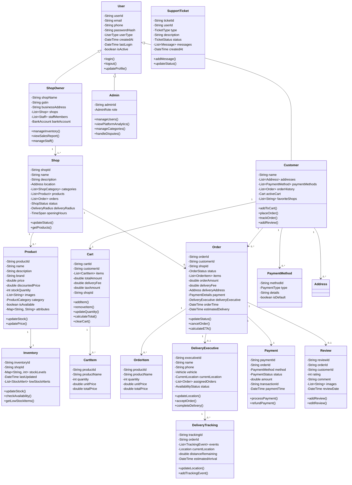

```mermaid
classDiagram
    %% User Management Classes
    class User {
        -String userId
        -String email
        -String phone
        -String passwordHash
        -UserType userType
        -DateTime createdAt
        -DateTime lastLogin
        -boolean isActive
        +login()
        +logout()
        +updateProfile()
    }

    class Customer {
        -String name
        -List~Address~ addresses
        -List~PaymentMethod~ paymentMethods
        -List~Order~ orderHistory
        -Cart activeCart
        -List~String~ favoriteShops
        +addToCart()
        +placeOrder()
        +trackOrder()
        +addReview()
    }

    class ShopOwner {
        -String shopName
        -String gstin
        -String businessAddress
        -List~Shop~ shops
        -List~Staff~ staffMembers
        -BankAccount bankAccount
        +manageInventory()
        +viewSalesReport()
        +manageStaff()
    }

    class Admin {
        -String adminId
        -AdminRole role
        +manageUsers()
        +viewPlatformAnalytics()
        +manageCategories()
        +handleDisputes()
    }

    %% Core E-commerce Classes
    class Shop {
        -String shopId
        -String name
        -String description
        -Address location
        -List~ShopCategory~ categories
        -List~Product~ products
        -List~Order~ orders
        -ShopStatus status
        -DeliveryRadius deliveryRadius
        -TimeSpan openingHours
        +updateStatus()
        +getProducts()
    }

    class Product {
        -String productId
        -String name
        -String description
        -String brand
        -double price
        -double discountedPrice
        -int stockQuantity
        -List~String~ images
        -ProductCategory category
        -boolean isAvailable
        -Map~String, String~ attributes
        +updateStock()
        +updatePrice()
    }

    class Inventory {
        -String inventoryId
        -String shopId
        -Map~String, int~ stockLevels
        -DateTime lastUpdated
        -List~StockAlert~ lowStockAlerts
        +updateStock()
        +checkAvailability()
        +getLowStockItems()
    }

    class Cart {
        -String cartId
        -String customerId
        -List~CartItem~ items
        -double totalAmount
        -double deliveryFee
        -double taxAmount
        -String shopId
        +addItem()
        +removeItem()
        +updateQuantity()
        +calculateTotal()
        +clearCart()
    }

    class CartItem {
        -String productId
        -String productName
        -int quantity
        -double unitPrice
        -double totalPrice
    }

    class Order {
        -String orderId
        -String customerId
        -String shopId
        -OrderStatus status
        -List~OrderItem~ items
        -double orderAmount
        -double deliveryFee
        -Address deliveryAddress
        -PaymentDetails payment
        -DeliveryExecutive deliveryExecutive
        -DateTime orderTime
        -DateTime estimatedDelivery
        +updateStatus()
        +cancelOrder()
        +calculateETA()
    }

    class OrderItem {
        -String productId
        -String productName
        -int quantity
        -double unitPrice
        -double totalPrice
    }

    %% Delivery & Logistics
    class DeliveryExecutive {
        -String executiveId
        -String name
        -String phone
        -Vehicle vehicle
        -CurrentLocation currentLocation
        -List~Order~ assignedOrders
        -AvailabilityStatus status
        +updateLocation()
        +acceptOrder()
        +completeDelivery()
    }

    class DeliveryTracking {
        -String trackingId
        -String orderId
        -List~TrackingEvent~ events
        -Location currentLocation
        -double distanceRemaining
        -DateTime estimatedArrival
        +updateLocation()
        +addTrackingEvent()
    }

    %% Payment System
    class Payment {
        -String paymentId
        -String orderId
        -PaymentMethod method
        -PaymentStatus status
        -double amount
        -String transactionId
        -DateTime paymentTime
        +processPayment()
        +refundPayment()
    }

    class PaymentMethod {
        -String methodId
        -PaymentType type
        -String details
        -boolean isDefault
    }

    %% Reviews & Support
    class Review {
        -String reviewId
        -String orderId
        -String customerId
        -int rating
        -String comment
        -List~String~ images
        -DateTime reviewDate
        +addReview()
        +editReview()
    }

    class SupportTicket {
        -String ticketId
        -String userId
        -TicketType type
        -String description
        -TicketStatus status
        -List~Message~ messages
        -DateTime createdAt
        +addMessage()
        +updateStatus()
    }

    %% Relationships
    User <|-- Customer
    User <|-- ShopOwner
    User <|-- Admin

    Customer "1" --> "0..*" Order
    Customer "1" --> "1" Cart
    Customer "1" --> "0..*" Address
    Customer "1" --> "0..*" PaymentMethod

    ShopOwner "1" --> "1..*" Shop
    Shop "1" --> "0..*" Product
    Shop "1" --> "0..*" Order
    
    Product "1" --> "1" Inventory
    Cart "1" --> "0..*" CartItem
    Order "1" --> "0..*" OrderItem
    
    Order "1" --> "0..1" DeliveryExecutive
    Order "1" --> "1" Payment
    Order "1" --> "0..1" Review
    
    DeliveryExecutive "1" --> "0..*" DeliveryTracking
```