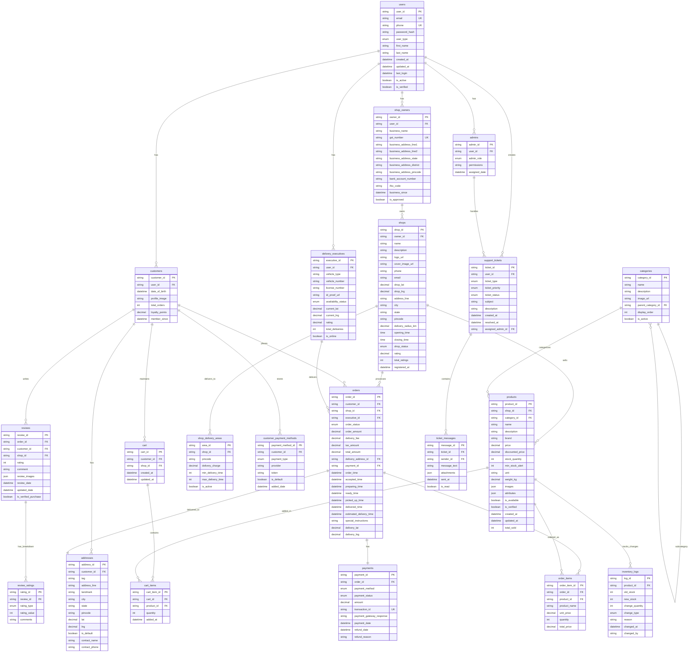

```mermaid
erDiagram
    %% User Management Entities
    users {
        string user_id PK
        string email UK
        string phone UK
        string password_hash
        enum user_type
        string first_name
        string last_name
        datetime created_at
        datetime updated_at
        datetime last_login
        boolean is_active
        boolean is_verified
    }

    customers {
        string customer_id PK
        string user_id FK
        datetime date_of_birth
        string profile_image
        int total_orders
        decimal loyalty_points
        datetime member_since
    }

    shop_owners {
        string owner_id PK
        string user_id FK
        string business_name
        string gst_number UK
        string business_address_line1
        string business_address_line2
        string business_address_state
        string business_address_district
        string business_address_pincode
        string bank_account_number
        string ifsc_code
        datetime business_since
        boolean is_approved
    }

    admins {
        string admin_id PK
        string user_id FK
        enum admin_role
        string permissions
        datetime assigned_date
    }

    delivery_executives {
        string executive_id PK
        string user_id FK
        string vehicle_type
        string vehicle_number
        string license_number
        string id_proof_url
        enum availability_status
        decimal current_lat
        decimal current_lng
        decimal rating
        int total_deliveries
        boolean is_online
    }

    %% Core Business Entities
    shops {
        string shop_id PK
        string owner_id FK
        string name
        string description
        string logo_url
        string cover_image_url
        string phone
        string email
        decimal shop_lat
        decimal shop_lng
        string address_line
        string city
        string state
        string pincode
        decimal delivery_radius_km
        time opening_time
        time closing_time
        enum shop_status
        decimal rating
        int total_ratings
        datetime registered_at
    }

    categories {
        string category_id PK
        string name
        string description
        string image_url
        string parent_category_id FK
        int display_order
        boolean is_active
    }

    products {
        string product_id PK
        string shop_id FK
        string category_id FK
        string name
        string description
        string brand
        decimal price
        decimal discounted_price
        int stock_quantity
        int min_stock_alert
        string unit
        decimal weight_kg
        json images
        json attributes
        boolean is_available
        boolean is_verified
        datetime created_at
        datetime updated_at
        int total_sold
    }

    inventory_logs {
        string log_id PK
        string product_id FK
        int old_stock
        int new_stock
        int change_quantity
        enum change_type
        string reason
        datetime changed_at
        string changed_by
    }

    %% Order Management Entities
    orders {
        string order_id PK
        string customer_id FK
        string shop_id FK
        string executive_id FK
        enum order_status
        decimal order_amount
        decimal delivery_fee
        decimal tax_amount
        decimal total_amount
        string delivery_address_id FK
        string payment_id FK
        datetime order_time
        datetime accepted_time
        datetime preparing_time
        datetime ready_time
        datetime picked_up_time
        datetime delivered_time
        datetime estimated_delivery_time
        string special_instructions
        decimal delivery_lat
        decimal delivery_lng
    }

    order_items {
        string order_item_id PK
        string order_id FK
        string product_id FK
        string product_name
        decimal unit_price
        int quantity
        decimal total_price
    }

    cart {
        string cart_id PK
        string customer_id FK
        string shop_id FK
        datetime created_at
        datetime updated_at
    }

    cart_items {
        string cart_item_id PK
        string cart_id FK
        string product_id FK
        int quantity
        datetime added_at
    }

    %% Address & Location Entities
    addresses {
        string address_id PK
        string customer_id FK
        string tag
        string address_line
        string landmark
        string city
        string state
        string pincode
        decimal lat
        decimal lng
        boolean is_default
        string contact_name
        string contact_phone
    }

    shop_delivery_areas {
        string area_id PK
        string shop_id FK
        string pincode
        decimal delivery_charge
        int min_delivery_time
        int max_delivery_time
        boolean is_active
    }

    %% Payment Entities
    payments {
        string payment_id PK
        string order_id FK
        enum payment_method
        enum payment_status
        decimal amount
        string transaction_id UK
        string payment_gateway_response
        datetime payment_date
        datetime refund_date
        string refund_reason
    }

    customer_payment_methods {
        string payment_method_id PK
        string customer_id FK
        enum payment_type
        string provider
        string token
        boolean is_default
        datetime added_date
    }

    %% Reviews & Support Entities
    reviews {
        string review_id PK
        string order_id FK
        string customer_id FK
        string shop_id FK
        int rating
        string comment
        json review_images
        datetime review_date
        datetime updated_date
        boolean is_verified_purchase
    }

    review_ratings {
        string rating_id PK
        string review_id FK
        enum rating_type
        int rating_value
        string comments
    }

    support_tickets {
        string ticket_id PK
        string user_id FK
        enum ticket_type
        enum ticket_priority
        enum ticket_status
        string subject
        string description
        datetime created_at
        datetime resolved_at
        string assigned_admin_id FK
    }

    ticket_messages {
        string message_id PK
        string ticket_id FK
        string sender_id FK
        string message_text
        json attachments
        datetime sent_at
        boolean is_read
    }

    %% Relationships Definition
    users ||--o{ customers : "has"
    users ||--o{ shop_owners : "has"
    users ||--o{ admins : "has"
    users ||--o{ delivery_executives : "has"

    shop_owners ||--o{ shops : "owns"
    shops ||--o{ products : "sells"
    shops ||--o{ orders : "processes"
    shops ||--o{ shop_delivery_areas : "delivers_to"

    categories ||--o{ products : "categorizes"
    categories ||--o{ categories : "subcategory"

    customers ||--o{ orders : "places"
    customers ||--o{ addresses : "has"
    customers ||--o{ cart : "maintains"
    customers ||--o{ customer_payment_methods : "stores"
    customers ||--o{ reviews : "writes"

    cart ||--o{ cart_items : "contains"
    products ||--o{ cart_items : "added_in"

    orders ||--o{ order_items : "contains"
    products ||--o{ order_items : "ordered_as"

    delivery_executives ||--o{ orders : "delivers"
    orders ||--|| payments : "has"
    orders ||--|| addresses : "delivered_to"

    products ||--o{ inventory_logs : "tracks_changes"

    reviews ||--o{ review_ratings : "has_breakdown"
    support_tickets ||--o{ ticket_messages : "contains"
    users ||--o{ support_tickets : "creates"
    admins ||--o{ support_tickets : "handles"
```