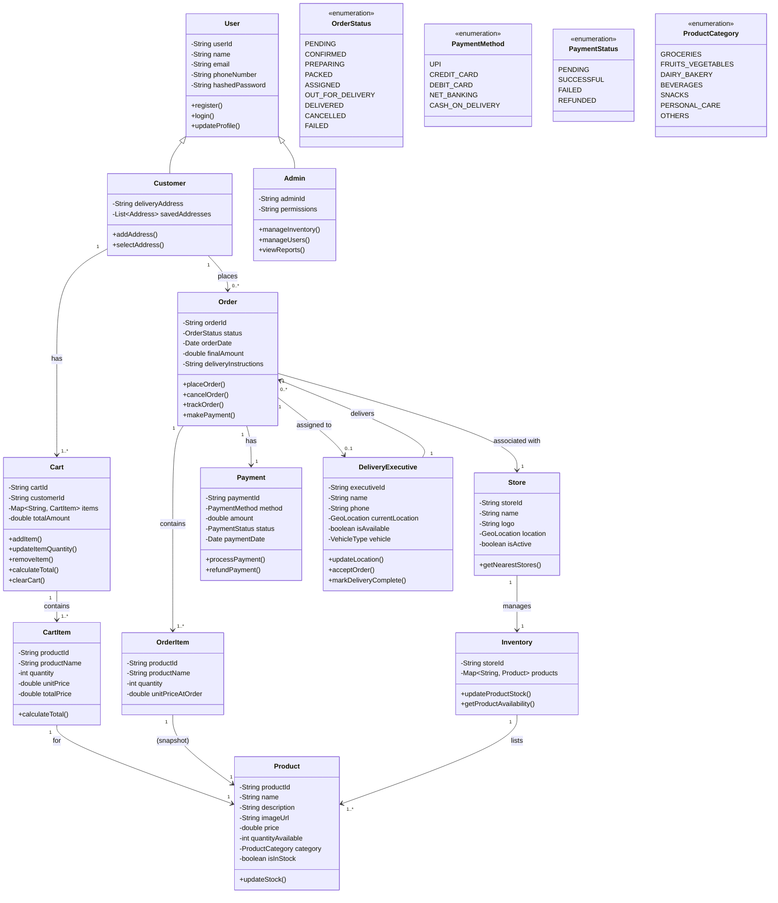

```mermaid
classDiagram
    %% User and related classes
    class User {
        -String userId
        -String name
        -String email
        -String phoneNumber
        -String hashedPassword
        +register()
        +login()
        +updateProfile()
    }

    class Customer {
        -String deliveryAddress
        -List~Address~ savedAddresses
        +addAddress()
        +selectAddress()
    }

    class Admin {
        -String adminId
        -String permissions
        +manageInventory()
        +manageUsers()
        +viewReports()
    }

    %% Core Business Logic
    class Store {
        -String storeId
        -String name
        -String logo
        -GeoLocation location
        -boolean isActive
        +getNearestStores()
    }

    class Product {
        -String productId
        -String name
        -String description
        -String imageUrl
        -double price
        -int quantityAvailable
        -ProductCategory category
        -boolean isInStock
        +updateStock()
    }

    class Inventory {
        -String storeId
        -Map~String, Product~ products
        +updateProductStock()
        +getProductAvailability()
    }

    class Cart {
        -String cartId
        -String customerId
        -Map~String, CartItem~ items
        -double totalAmount
        +addItem()
        +updateItemQuantity()
        +removeItem()
        +calculateTotal()
        +clearCart()
    }

    class CartItem {
        -String productId
        -String productName
        -int quantity
        -double unitPrice
        -double totalPrice
        +calculateTotal()
    }

    class Order {
        -String orderId
        -OrderStatus status
        -Date orderDate
        -double finalAmount
        -String deliveryInstructions
        +placeOrder()
        +cancelOrder()
        +trackOrder()
        +makePayment()
    }

    class OrderItem {
        -String productId
        -String productName
        -int quantity
        -double unitPriceAtOrder
    }

    %% Payment and Delivery
    class Payment {
        -String paymentId
        -PaymentMethod method
        -double amount
        -PaymentStatus status
        -Date paymentDate
        +processPayment()
        +refundPayment()
    }

    class DeliveryExecutive {
        -String executiveId
        -String name
        -String phone
        -GeoLocation currentLocation
        -boolean isAvailable
        -VehicleType vehicle
        +updateLocation()
        +acceptOrder()
        +markDeliveryComplete()
    }

    %% Enumerations
    class OrderStatus {
        <<enumeration>>
        PENDING
        CONFIRMED
        PREPARING
        PACKED
        ASSIGNED
        OUT_FOR_DELIVERY
        DELIVERED
        CANCELLED
        FAILED
    }

    class PaymentMethod {
        <<enumeration>>
        UPI
        CREDIT_CARD
        DEBIT_CARD
        NET_BANKING
        CASH_ON_DELIVERY
    }

    class PaymentStatus {
        <<enumeration>>
        PENDING
        SUCCESSFUL
        FAILED
        REFUNDED
    }

    class ProductCategory {
        <<enumeration>>
        GROCERIES
        FRUITS_VEGETABLES
        DAIRY_BAKERY
        BEVERAGES
        SNACKS
        PERSONAL_CARE
        OTHERS
    }

    %% Relationships
    User <|-- Customer
    User <|-- Admin

    Customer "1" --> "1..*" Cart : has
    Customer "1" --> "0..*" Order : places

    Cart "1" --> "1..*" CartItem : contains
    CartItem "1" --> "1" Product : for

    Order "1" --> "1" Payment : has
    Order "1" --> "1..*" OrderItem : contains
    OrderItem "1" --> "1" Product : (snapshot)

    Store "1" --> "1" Inventory : manages
    Inventory "1" --> "1..*" Product : lists

    Order "1" --> "1" Store : associated with
    Order "1" --> "0..1" DeliveryExecutive : assigned to
    DeliveryExecutive "1" --> "0..*" Order : delivers
```