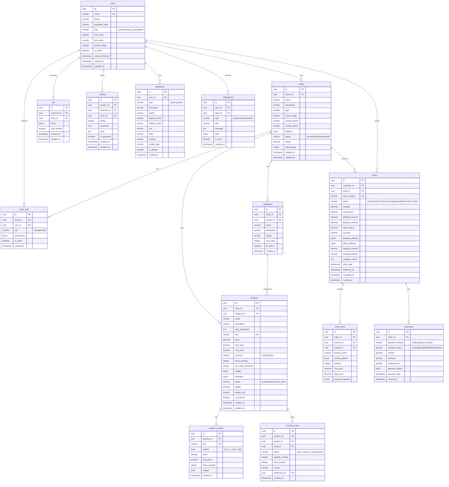

```mermaid
erDiagram
    %% Users and Authentication
    users {
        uuid id PK
        varchar email UK
        varchar phone
        varchar password_hash
        varchar role "customer|shop_owner|admin"
        varchar first_name
        varchar last_name
        varchar profile_image
        boolean is_active
        timestamp email_verified_at
        timestamp created_at
        timestamp updated_at
    }

    shops {
        uuid id PK
        uuid owner_id FK
        varchar name
        varchar description
        varchar logo
        varchar cover_image
        varchar contact_email
        varchar contact_phone
        jsonb address
        varchar status "active|inactive|suspended"
        decimal rating
        integer total_ratings
        timestamp created_at
        timestamp updated_at
    }

    shop_staff {
        uuid id PK
        uuid shop_id FK
        uuid user_id FK
        varchar role "manager|staff"
        jsonb permissions
        boolean is_active
        timestamp created_at
    }

    categories {
        uuid id PK
        uuid shop_id FK
        uuid parent_id FK
        varchar name
        varchar description
        varchar image
        integer sort_order
        boolean is_active
        timestamp created_at
    }

    products {
        uuid id PK
        uuid shop_id FK
        uuid category_id FK
        varchar name
        varchar description
        text long_description
        varchar sku UK
        decimal price
        decimal sale_price
        decimal cost_price
        varchar currency "USD|EUR|etc"
        integer stock_quantity
        integer low_stock_threshold
        jsonb images
        jsonb attributes
        varchar status "active|inactive|out_of_stock"
        decimal weight
        varchar weight_unit
        boolean is_featured
        timestamp created_at
        timestamp updated_at
    }

    product_variants {
        uuid id PK
        uuid product_id FK
        varchar sku UK
        jsonb options "size: 'L', color: 'Red'"
        decimal price
        decimal sale_price
        integer stock_quantity
        jsonb images
        timestamp created_at
    }

    inventory_logs {
        uuid id PK
        uuid product_id FK
        uuid variant_id FK
        uuid shop_id FK
        varchar action "stock_in|stock_out|adjustment"
        integer quantity_change
        integer new_quantity
        varchar reason
        uuid performed_by FK
        timestamp created_at
    }

    orders {
        uuid id PK
        uuid customer_id FK
        uuid shop_id FK
        varchar order_number UK
        varchar status "pending|confirmed|processing|shipped|delivered|cancelled"
        decimal subtotal
        decimal tax_amount
        decimal shipping_amount
        decimal discount_amount
        decimal total_amount
        varchar currency
        jsonb shipping_address
        jsonb billing_address
        varchar shipping_method
        varchar tracking_number
        text customer_notes
        timestamp order_date
        timestamp delivered_at
        timestamp cancelled_at
        timestamp created_at
    }

    order_items {
        uuid id PK
        uuid order_id FK
        uuid product_id FK
        uuid variant_id FK
        varchar product_name
        jsonb variant_options
        integer quantity
        decimal unit_price
        decimal total_price
        jsonb product_snapshot
    }

    payments {
        uuid id PK
        uuid order_id FK
        varchar payment_method "card|cash|bank_transfer"
        varchar payment_status "pending|completed|failed|refunded"
        decimal amount
        varchar currency
        varchar transaction_id
        jsonb payment_details
        timestamp payment_date
        timestamp created_at
    }

    cart {
        uuid id PK
        uuid customer_id FK
        uuid shop_id FK
        jsonb items
        decimal total_amount
        timestamp created_at
        timestamp updated_at
    }

    reviews {
        uuid id PK
        uuid product_id FK
        uuid customer_id FK
        uuid order_id FK
        integer rating
        text comment
        text reply
        boolean is_approved
        timestamp created_at
        timestamp updated_at
    }

    addresses {
        uuid id PK
        uuid user_id FK
        varchar type "shipping|billing"
        varchar full_name
        varchar phone
        varchar address_line1
        varchar address_line2
        varchar city
        varchar state
        varchar country
        varchar postal_code
        boolean is_default
        timestamp created_at
    }

    notifications {
        uuid id PK
        uuid user_id FK
        uuid shop_id FK
        varchar type "order|inventory|system"
        varchar title
        text message
        jsonb data
        boolean is_read
        timestamp created_at
    }

    %% Relationships
    users ||--o{ shops : "owns"
    users ||--o{ shop_staff : "employs"
    shops ||--o{ shop_staff : "has"
    shops ||--o{ categories : "has"
    shops ||--o{ products : "sells"
    shops ||--o{ orders : "receives"
    categories ||--o{ products : "categorizes"
    products ||--o{ product_variants : "has"
    products ||--o{ inventory_logs : "tracks"
    users ||--o{ orders : "places"
    orders ||--o{ order_items : "contains"
    orders ||--o{ payments : "has"
    users ||--o{ cart : "maintains"
    users ||--o{ reviews : "writes"
    users ||--o{ addresses : "has"
    users ||--o{ notifications : "receives"

```