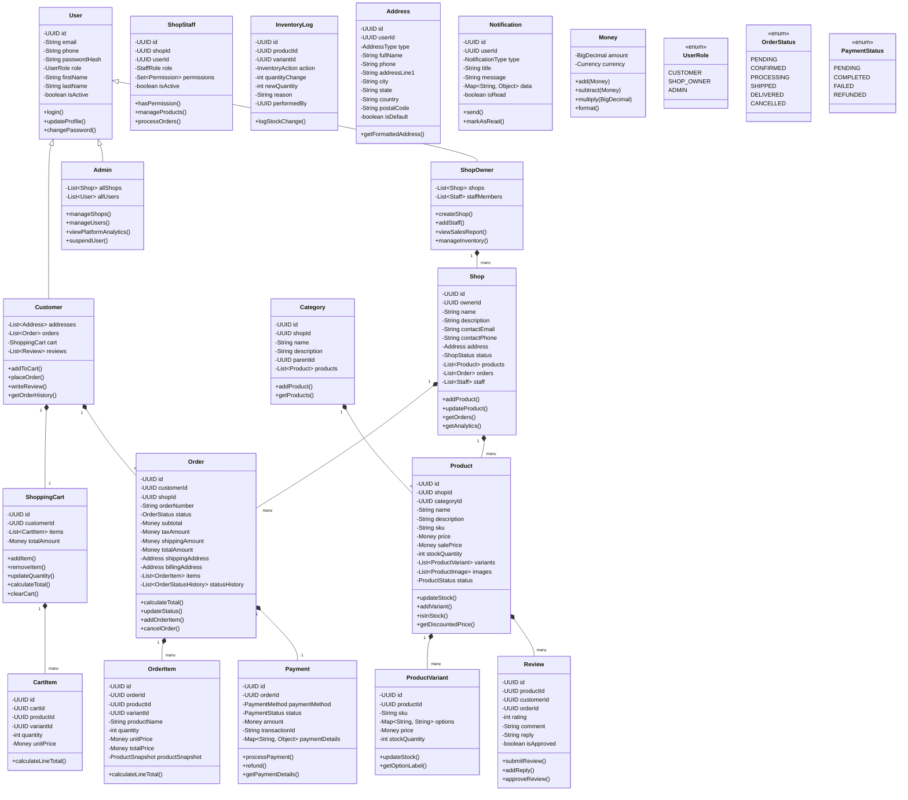

```mermaid
classDiagram
    %% Core User Classes
    class User {
        -UUID id
        -String email
        -String phone
        -String passwordHash
        -UserRole role
        -String firstName
        -String lastName
        -boolean isActive
        +login()
        +updateProfile()
        +changePassword()
    }

    class Customer {
        -List~Address~ addresses
        -List~Order~ orders
        -ShoppingCart cart
        -List~Review~ reviews
        +addToCart()
        +placeOrder()
        +writeReview()
        +getOrderHistory()
    }

    class ShopOwner {
        -List~Shop~ shops
        -List~Staff~ staffMembers
        +createShop()
        +addStaff()
        +viewSalesReport()
        +manageInventory()
    }

    class Admin {
        -List~Shop~ allShops
        -List~User~ allUsers
        +manageShops()
        +manageUsers()
        +viewPlatformAnalytics()
        +suspendUser()
    }

    %% Shop Management
    class Shop {
        -UUID id
        -UUID ownerId
        -String name
        -String description
        -String contactEmail
        -String contactPhone
        -Address address
        -ShopStatus status
        -List~Product~ products
        -List~Order~ orders
        -List~Staff~ staff
        +addProduct()
        +updateProduct()
        +getOrders()
        +getAnalytics()
    }

    class ShopStaff {
        -UUID id
        -UUID shopId
        -UUID userId
        -StaffRole role
        -Set~Permission~ permissions
        -boolean isActive
        +hasPermission()
        +manageProducts()
        +processOrders()
    }

    %% Product Catalog
    class Category {
        -UUID id
        -UUID shopId
        -String name
        -String description
        -UUID parentId
        -List~Product~ products
        +addProduct()
        +getProducts()
    }

    class Product {
        -UUID id
        -UUID shopId
        -UUID categoryId
        -String name
        -String description
        -String sku
        -Money price
        -Money salePrice
        -int stockQuantity
        -List~ProductVariant~ variants
        -List~ProductImage~ images
        -ProductStatus status
        +updateStock()
        +addVariant()
        +isInStock()
        +getDiscountedPrice()
    }

    class ProductVariant {
        -UUID id
        -UUID productId
        -String sku
        -Map~String, String~ options
        -Money price
        -int stockQuantity
        +updateStock()
        +getOptionLabel()
    }

    class InventoryLog {
        -UUID id
        -UUID productId
        -UUID variantId
        -InventoryAction action
        -int quantityChange
        -int newQuantity
        -String reason
        -UUID performedBy
        +logStockChange()
    }

    %% Order Management
    class Order {
        -UUID id
        -UUID customerId
        -UUID shopId
        -String orderNumber
        -OrderStatus status
        -Money subtotal
        -Money taxAmount
        -Money shippingAmount
        -Money totalAmount
        -Address shippingAddress
        -Address billingAddress
        -List~OrderItem~ items
        -List~OrderStatusHistory~ statusHistory
        +calculateTotal()
        +updateStatus()
        +addOrderItem()
        +cancelOrder()
    }

    class OrderItem {
        -UUID id
        -UUID orderId
        -UUID productId
        -UUID variantId
        -String productName
        -int quantity
        -Money unitPrice
        -Money totalPrice
        -ProductSnapshot productSnapshot
        +calculateLineTotal()
    }

    class ShoppingCart {
        -UUID id
        -UUID customerId
        -List~CartItem~ items
        -Money totalAmount
        +addItem()
        +removeItem()
        +updateQuantity()
        +calculateTotal()
        +clearCart()
    }

    class CartItem {
        -UUID id
        -UUID cartId
        -UUID productId
        -UUID variantId
        -int quantity
        -Money unitPrice
        +calculateLineTotal()
    }

    %% Payment System
    class Payment {
        -UUID id
        -UUID orderId
        -PaymentMethod paymentMethod
        -PaymentStatus status
        -Money amount
        -String transactionId
        -Map~String, Object~ paymentDetails
        +processPayment()
        +refund()
        +getPaymentDetails()
    }

    %% Reviews and Ratings
    class Review {
        -UUID id
        -UUID productId
        -UUID customerId
        -UUID orderId
        -int rating
        -String comment
        -String reply
        -boolean isApproved
        +submitReview()
        +addReply()
        +approveReview()
    }

    %% Support Classes
    class Address {
        -UUID id
        -UUID userId
        -AddressType type
        -String fullName
        -String phone
        -String addressLine1
        -String city
        -String state
        -String country
        -String postalCode
        -boolean isDefault
        +getFormattedAddress()
    }

    class Notification {
        -UUID id
        -UUID userId
        -NotificationType type
        -String title
        -String message
        -Map~String, Object~ data
        -boolean isRead
        +send()
        +markAsRead()
    }

    class Money {
        -BigDecimal amount
        -Currency currency
        +add(Money)
        +subtract(Money)
        +multiply(BigDecimal)
        +format()
    }

    %% Enums
    class UserRole {
        <<enum>>
        CUSTOMER
        SHOP_OWNER
        ADMIN
    }

    class OrderStatus {
        <<enum>>
        PENDING
        CONFIRMED
        PROCESSING
        SHIPPED
        DELIVERED
        CANCELLED
    }

    class PaymentStatus {
        <<enum>>
        PENDING
        COMPLETED
        FAILED
        REFUNDED
    }

    %% Relationships
    User <|-- Customer
    User <|-- ShopOwner
    User <|-- Admin
    
    Shop "1" *-- "many" Product
    Shop "1" *-- "many" Order
    ShopOwner "1" *-- "many" Shop
    
    Product "1" *-- "many" ProductVariant
    Product "1" *-- "many" Review
    
    Order "1" *-- "many" OrderItem
    Order "1" *-- "1" Payment
    
    Customer "1" *-- "many" Order
    Customer "1" *-- "1" ShoppingCart
    ShoppingCart "1" *-- "many" CartItem
    
    Category "1" *-- "many" Product
```